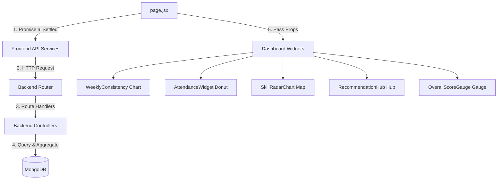

# Student Dashboard Technical Documentation

This documentation provides an end-to-end overview of the **Student Dashboard** in the Language Lab application, details of the UI components, frontend service clients, backend API routing, database models, and internal controller implementations.

---

## Table of Contents
1. [System Architecture Overview](#1-system-architecture-overview)
2. [Frontend Architecture & Component Breakdown](#2-frontend-architecture--component-breakdown)
   - [Main Dashboard Page (`page.jsx`)](#main-dashboard-page-pagejsx)
   - [UI Component Breakdown (`/src/components/organisms`)](#ui-component-breakdown-srccomponentsorganisms)
3. [Frontend API Integration (`/src/services`)](#3-frontend-api-integration-srcservices)
4. [Backend Routing Structure (`/src/routes`)](#4-backend-routing-structure-srcroutes)
5. [Backend Controller Logic Deep Dive (`/src/controller`)](#5-backend-controller-logic-deep-dive-srccontroller)
6. [Database Schema Definitions (`/src/models`)](#6-database-schema-definitions-srcmodels)

---

## 1. System Architecture Overview

The Student Dashboard is designed to provide language learners with real-time feedback on their cognitive progress, learning streak, attendance records, study patterns, and AI Coach interactions.

It operates in two modes:
1. **Live Database Syncing**: Automatically fetches logged-in student statistics from live backend APIs using secure Bearer authentication tokens.
2. **Interactive Demo Mode**: Populates mockup charts and datasets locally so that users can instantly visualize rich metrics without pre-existing study logs.

---

## 2. Frontend Architecture & Component Breakdown

### Main Dashboard Page (`page.jsx`)
- **File Path**: [page.jsx](file:///c:/Users/HP/Language-Lab-Frontend/src/app/dashboard/page.jsx)
- **Role**: Serves as the central state controller. It mounts the background animations and layouts, and triggers concurrent queries to populate student stats.
- **Key Operations**:
  - Uses `Promise.allSettled` to issue 6 asynchronous requests simultaneously (avoiding request blocking):
    - `progressApi.getMyProgress()`
    - `activityApi.getMyActivity()`
    - `attendanceApi.getMyAttendance()`
    - `aiApi.getHistory()`
    - `studentApi.getEnrolledCourses()`
    - `progressApi.getDashboardKPI()`
  - **Learning Streak Algorithm**: Iterates through the sorted list of attendance history. Checks if the student was marked `"present"` today or yesterday, then counts backward day-by-day to compute the continuous daily streak.
  - **State Containers**: Tracks `progress`, `activities`, `attendance`, `aiHistory`, and aggregated `statsData`.

### UI Component Breakdown (`/src/components/organisms`)

#### A. Dashboard Stats Cards
- **File Path**: [DashboardStats.jsx](file:///c:/Users/HP/Language-Lab-Frontend/src/components/organisms/DashboardStats.jsx)
- **Props**: `statsData`
- **Widgets Rendered**:
  1. *Enrolled Courses*: Displays the total number of courses the student has access to.
  2. *Total Lessons*: Displays total subtopics in the curriculum alongside a sub-label counting completed lessons.
  3. *Incomplete Lessons*: Highlights remaining subtopics, broken down by *In Progress* and *Not Started*.

#### B. Weekly Consistency Chart
- **File Path**: [WeeklyConsistency.jsx](file:///c:/Users/HP/Language-Lab-Frontend/src/components/organisms/WeeklyConsistency.jsx)
- **Props**: `activities`, `attendance`
- **Description**: Renders a Recharts `<ComposedChart>` comparing daily study minutes against lesson count.
- **Data Aggregation**: Extracts records from the last 7 calendar days. Converts raw media session seconds to study minutes (rendered as a `Bar` chart in amber) and counts completed activities (`activity_type` ends with `"_complete"`, rendered as a blue `Line` graph overlay).

#### C. Recent Activity Log
- **File Path**: [RecentActivity.jsx](file:///c:/Users/HP/Language-Lab-Frontend/src/components/organisms/RecentActivity.jsx)
- **Props**: `activitiesData`
- **Description**: Renders a vertical timeline showing the latest 10 activities of the student.
- **Mapping Logic**: Maps activity and module types (e.g. AI queries, video module training, speaker module actions, attendance marks) to custom icons and colors. Shows a fallback list of 10 mock entries if no live user activity data is present.

#### D. Attendance Widget Donut Ring
- **File Path**: [AttendanceWidget.jsx](file:///c:/Users/HP/Language-Lab-Frontend/src/components/organisms/AttendanceWidget.jsx)
- **Props**: `attendance`
- **Description**: Renders a Recharts `<PieChart>` donut representing Present vs. Absent days.
- **Low Attendance Warning**: Automatically triggers an alert box warning if the calculated attendance rate drops below **75%**.

#### E. Skill Competency Radar Map
- **File Path**: [SkillRadarChart.jsx](file:///c:/Users/HP/Language-Lab-Frontend/src/components/organisms/SkillRadarChart.jsx)
- **Props**: `progress`
- **Description**: Displays cognitive proficiency across 5 critical module skill sets.
- **Aggregation Logic**:
  - Compiles progress/scores for each module: **Speaking/Listening** (`audio`), **Comprehension** (`video`), **Reading** (`text`), **Grammar/Quiz** (`exercise`), and **Vocabulary** (`vocabulary`).
  - Exercises use assessment challenge scores, whereas other modules use progress percentage.
  - Renders a responsive `<RadarChart>` with custom gradient fills and interactive tooltips.

#### F. Syllabus Completion & Recommendation Hub
- **File Path**: [RecommendationHub.jsx](file:///c:/Users/HP/Language-Lab-Frontend/src/components/organisms/RecommendationHub.jsx)
- **Props**: `progress`, `moduleBreakdown`
- **Description**: Displays overall curriculum completion stats using a Recharts `<PieChart>` and lists the top 3 pending/incomplete modules.
- **Smart Navigation**: Generates a deep link to direct the student straight back to where they left off (e.g., `/dashboard/module/[type]/[subtopic_id]`).

#### G. Overall Score Speedometer Gauge
- **File Path**: [OverallScoreGauge.jsx](file:///c:/Users/HP/Language-Lab-Frontend/src/components/organisms/OverallScoreGauge.jsx)
- **Props**: `progress`
- **Description**: Displays the student's cumulative score as a dashboard needle-gauge.
- **Mathematics / SVG Rendering**:
  - Calculates the average score across completed modules.
  - Generates a segmented speedometer arc utilizing SVG paths (coordinates derived from trigonometry via `polarToCartesian`).
  - Draws an animated needle pointing to the student's average percentage (0% to 100%).
  - Shows individual sub-skill progression bars at the base of the widget.

---

## 3. Frontend API Integration (`/src/services`)

The frontend calls backend APIs through modular service interfaces backed by a centralized Axios client:

| Service Name | API Method Function | Route Endpoint called | HTTP Verb | Purpose |
| :--- | :--- | :--- | :---: | :--- |
| **`progressApi`** | `getMyProgress()` | `/progress/me` | GET | Retrieve user-specific module progress lists |
| | `getDashboardKPI()` | `/progress/dashboard-kpi` | GET | Retrieve computed counts, breakdowns, and completion levels |
| **`activityApi`** | `getMyActivity()` | `/activity/me` | GET | Fetch chronological list of student activity logs |
| **`attendanceApi`**| `getMyAttendance(params)`| `/attendance/me` | GET | Fetch student's own login and attendance list |
| **`aiApi`** | `getHistory(params)` | `/ai/history` | GET | Fetch questions and answers logged with the AI Coach |
| **`studentApi`** | `getEnrolledCourses()` | `/student/me/courses` | GET | Fetch list of active courses student is enrolled in |

---

## 4. Backend Routing Structure (`/src/routes`)

All endpoints are protected by middleware that validates the JWT in requests, resolves user roles, and verifies student/editor access permissions:

### Progress Routes
- **File Path**: [progressRoutes.js](file:///e:/Uttirna/lang_lab_backend/Language-Lab-Bakend-Project/src/routes/progressRoutes.js)
- **Endpoints**:
  - `GET /me` (Student access only): Calls `progressController.getMyProgress`.
  - `GET /dashboard-kpi` (Student access only): Calls `progressController.getDashboardKPI`.

### Activity Routes
- **File Path**: [activityRoutes.js](file:///e:/Uttirna/lang_lab_backend/Language-Lab-Bakend-Project/src/routes/activityRoutes.js)
- **Endpoints**:
  - `POST /` (Student access only): Logs a new student action. Calls `activityController.log`.
  - `GET /me` (Student access only): Calls `activityController.getMyActivity`.

### Attendance Routes
- **File Path**: [attendanceRoutes.js](file:///e:/Uttirna/lang_lab_backend/Language-Lab-Bakend-Project/src/routes/attendanceRoutes.js)
- **Endpoints**:
  - `GET /me` (Student access only): Returns own records. Calls `attendanceController.getMyAttendance`.

### AI Tutor Routes
- **File Path**: [aiRoutes.js](file:///e:/Uttirna/lang_lab_backend/Language-Lab-Bakend-Project/src/routes/aiRoutes.js)
- **Endpoints**:
  - `POST /ask` (Student access only): Send a message to AI Coach. Calls `aiController.ask`.
  - `GET /history` (Student access only): Calls `aiController.getHistory`.

### Student Routes
- **File Path**: [studentRoutes.js](file:///e:/Uttirna/lang_lab_backend/Language-Lab-Bakend-Project/src/routes/studentRoutes.js)
- **Endpoints**:
  - `GET /me/courses` (Student access only): Calls `studentController.getMyCourses`.

---

## 5. Backend Controller Logic Deep Dive (`/src/controller`)

### Progress Controller
- **File Path**: [progressController.js](file:///e:/Uttirna/lang_lab_backend/Language-Lab-Bakend-Project/src/controller/progressController.js)

#### `getMyProgress`
- **Operation**: Runs a MongoDB aggregation pipeline against the `StudentProgress` collection matching the student's ID.
- **Steps**:
  1. Matches records with `student_id`.
  2. Sorts descending by `last_accessed` (most recent first).
  3. Executes a `$lookup` on the `topics` collection to project topic titles.
  4. Executes a `$lookup` on the `subtopics` collection to project lesson/subtopic titles.
  5. Unwinds fields (`$unwind`) to return objects instead of arrays.

#### `getDashboardKPI`
- **Operation**: Compiles overall stats (Completed, In Progress, Not Started counts).
- **Steps**:
  1. Finds all purchased courses of the current student.
  2. Traverses courses to collect active `topic_ids`.
  3. Queries the `SubTopic` collection to fetch all active lessons.
  4. Queries all active module IDs across **5 module tables** (Video, Audio, Text, Exercise, Vocabulary) mapping to those subtopics.
  5. Fetches the student's `StudentProgress` records matching those active module IDs.
  6. Classifies lesson completion:
     - **Completed**: All modules belonging to a lesson have 100% progress.
     - **In Progress**: Average progress > 0% but less than 100% or at least one module has been started.
     - **Not Started**: All modules have 0% progress.
  7. Returns aggregated metrics counts and module breakdowns.

### Activity Controller
- **File Path**: [activityController.js](file:///e:/Uttirna/lang_lab_backend/Language-Lab-Bakend-Project/src/controller/activityController.js)

#### `log`
- **Operation**: Creates a new record in `ActivityLog`.
- **Side Effects**:
  - **Progress Auto-Upsert**: If the logged `activity_type` ends with `"_complete"`, it triggers a `findOneAndUpdate` to upsert a completed record in `StudentProgress` (setting `progress_percentage: 100` and `is_completed: true`).
  - **Attendance Auto-Marking**: If `activity_type === "attendance_marked"`, it automatically upserts today's date in the `Attendance` collection with state `"present"`.

#### `getMyActivity`
- **Operation**: Returns the 500 most recent activity logs sorted chronologically descending.

### Attendance Controller
- **File Path**: [attendanceController.js](file:///e:/Uttirna/lang_lab_backend/Language-Lab-Bakend-Project/src/controller/attendanceController.js)

#### `getMyAttendance`
- **Operation**: Fetches attendance records, filtering by optional `from` and `to` date parameters.
- **Aggregation**: Iterates through the found records, calculating `total_days`, count of `present` statuses, and count of `absent` statuses.

### AI Tutor Controller
- **File Path**: [aiController.js](file:///e:/Uttirna/lang_lab_backend/Language-Lab-Bakend-Project/src/controller/aiController.js)

#### `ask`
- **Operation**: Sends questions to the local Ollama LLM service and logs chat history.
- **Steps**:
  1. Resolves `sub_topic_id` and the parent topic details.
  2. Queries the specific module content details (video transcript, text body, or vocabulary meaning lists) and grabs the first 400 characters to form context.
  3. Prepares messages for Ollama (`llama3.2` model by default) with standard learning instructions (limit answers under 120 words, keep answers in English, forbid off-topic queries).
  4. Submits the prompt to Ollama, receives the response, inserts the record into `ChatHistory`, and logs an `"ai_query"` event in the `ActivityLog`.

### Student Controller
- **File Path**: [studentController.js](file:///e:/Uttirna/lang_lab_backend/Language-Lab-Bakend-Project/src/controller/studentController.js)

#### `getMyCourses`
- **Operation**: Runs a MongoDB aggregation pipeline to lookup enrolled courses.
- **Steps**:
  1. Matches the student record using `req.student._id`.
  2. Performs a `$lookup` against the `courses` collection where `is_active: true`, projecting only structural fields (name, code, thumbnail, etc.).

---

## 6. Database Schema Definitions (`/src/models`)

The dashboard features leverage the following Mongoose schemas:

### A. StudentProgress
Tracks individual student learning completions for modules.
- `student_id`: `ObjectId` (References `Student` model)
- `institute_id`: `ObjectId` (References `Institute` model)
- `license_id`: `ObjectId` (References `License` model)
- `topic_id`: `ObjectId` (References `Topic` model)
- `subtopic_id`: `ObjectId` (References `SubTopic` model)
- `module_id`: `ObjectId` (Dynamic reference depending on `module_type`)
- `module_type`: `String` (Enum: `'video'`, `'audio'`, `'text'`, `'exercise'`, `'vocabulary'`)
- `progress_percentage`: `Number` (Progress level: `0` to `100`)
- `is_completed`: `Boolean`
- `score`: `Number` (Assessment scores)
- `last_accessed`: `Date`
- `completed_at`: `Date`

### B. ActivityLog
Audits chronological action logs.
- `student_id`: `ObjectId` (References `Student`)
- `institute_id`: `ObjectId` (References `Institute`)
- `topic_id`: `ObjectId` (References `Topic`)
- `sub_topic_id`: `ObjectId` (References `SubTopic`)
- `module_type`: `String`
- `activity_type`: `String` (Enum: `'video_start'`, `'video_complete'`, `'audio_start'`, `'audio_complete'`, `'exercise_start'`, `'exercise_complete'`, `'ai_query'`, `'attendance_marked'`, etc.)
- `time_spent_sec`: `Number`
- `score`: `Number`
- `max_score`: `Number`
- `accuracy`: `Number`
- `logged_at`: `Date` (Defaults to current date/time)

### C. Attendance
Tracks daily logins per student.
- `student_id`: `ObjectId` (References `Student`)
- `institute_id`: `ObjectId` (References `Institute`)
- `license_id`: `ObjectId` (References `License`)
- `date`: `Date` (Normalized to midnight `00:00:00.000`)
- `login_time`: `Date`
- `status`: `String` (Enum: `'present'`, `'absent'`)

### D. ChatHistory
Stores dialogues between students and the AI Coach.
- `student_id`: `ObjectId` (References `Student`)
- `institute_id`: `ObjectId` (References `Institute`)
- `session_id`: `ObjectId`
- `topic_id`: `ObjectId` (References `Topic`)
- `subtopic_id`: `ObjectId` (References `SubTopic`)
- `module_type`: `String`
- `question`: `String` (Student query)
- `answer`: `String` (AI response)
- `model`: `String` (LLM model name used)
- `tokens_used`: `Number`
- `createdAt`: `Date`
